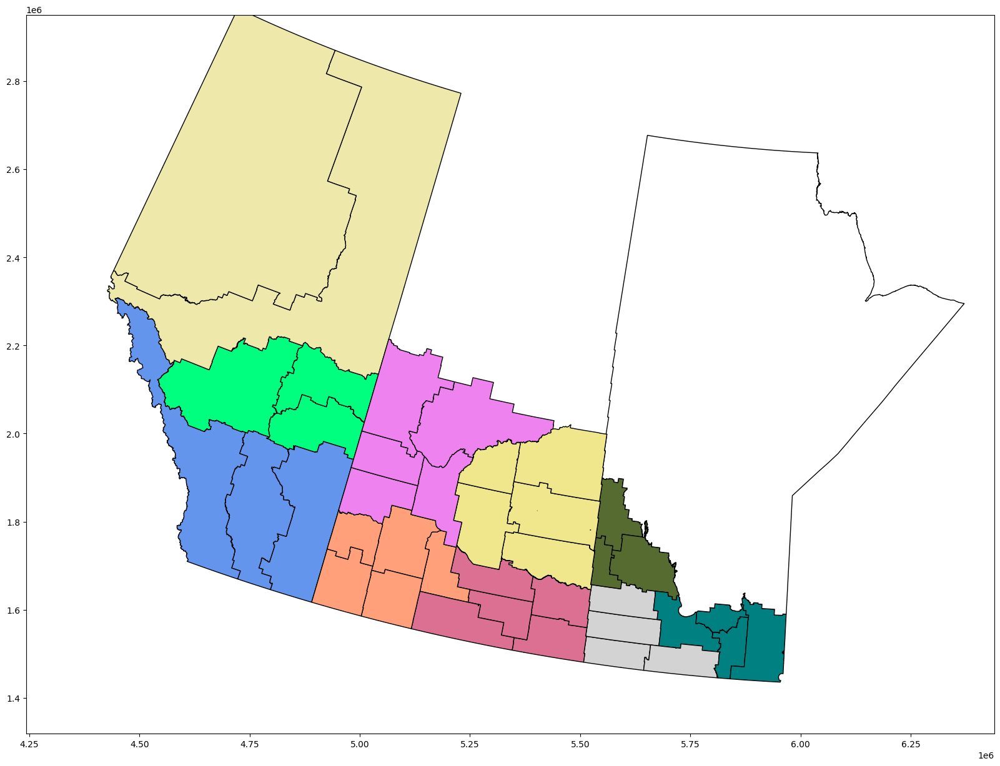

<div align="center">
<h1>CGC Grain Outcome Predictions</h1>

<br>

<h4>Ergot is a plant disease that infects the developing grains of cereals and grasses. When ergot bodies instead of kernels emerge during kernel formation, ergot symptoms become visible. To find a strategy to prevent it sooner, it is crucial to identify the factors that encourage it to grow in grain. Our project aims to build a tool that supports this research and provides tools for data analysis for the Canadian Grain Commission.<h4>


<br>
<br>
<div align="right">

</div>
</div>

## Overview
- [Setting up the environment](#setting-up-the-environment)
    - [Host Dependencies](#host-dependencies)
    - [Setting up on Windows](#setting-up-on-windows)
    - [Setting up on Linux](#setting-up-on-linux)
    - [Containers](#containers)
        - [PGAdmin](#pgadmin)
        - [PostgreSQL](#postgresql)
        - [Tensorflow](#tensorflow)
    - [Using Aviary Labs](#using-aviary-labs)
        - [Setting up credentials](#setting-up-credentials)
        - [Commands](#commands)
        - [Accessing the system with VSCode]()
- [Data Sources](#data-sources)
- [Database Tables](#data-attributes)
    - [2006 Census Agricultural Regions](#2006-census-agricultural-regions)
    - [Weather Stations](#weather-stations)
    - [Daily Weather Station Data](#daily-weather-station-data)
    - [Hourly Weather Station Data](#hourly-weather-station-data)
    - [ERA5-Land Satelite Data](#era5-land-satelite-data)
    - [Harvest Canada Ergot Data](#harvest-canada-ergot-data)
    - [Soil Moisture Data](#soil-moisture-data)
- [Useful links](#useful-links)

<br>
<hr>
<br>

## Setting up the environment
Our current environment uses docker compose to launch containers housing [PGADMIN4](#pgadmin), [PostgreSQL](#postgresql) and the latest [Tensorflow Container with Jupyter Lab](#tensorflow). 


### Host Dependencies
- [Docker](https://www.docker.com/products/docker-desktop/)
- [Docker Compose](https://docs.docker.com/compose/install/)
- [Python](https://www.python.org/downloads/)
- [Tensorflow](https://www.tensorflow.org/install/docker)
    - NVIDIA GPU Drivers (if using tensorflow-gpu) follow [official guide](https://docs.nvidia.com/deeplearning/frameworks/tensorflow-release-notes/running.html) guide for installation.

<br>

### Setting up on Windows
1. Install dependencies and clone project

2. Navigate to the project directory 

3. Create a .env file which satisfies the requirements of [.env.template](src/docker/.env.template). **Ensure this .env file can be found inside of the src/docker directory**

4. Run ```setup.bat``` located in the root folder of the project directory. This launches 3 different containers: postgres, pgadmin, and tensorflow-cpu

5. Refresh the webpages that appear to respectively load pgadmin and Jupyter labs. Jupyter labs requires a token for entry.

<br>

### Setting up on Linux
1. Install dependencies and clone project. Note that installation commands should be ran with BASH. BASH can be activated by ```bash```

1. Navigate to the project directory then enter the command ```cd src/docker```

2. Create a .env file which satisfies the requirements of [.env.template](src/docker/.env.template)

3. Run docker-compose for the containers you would like to use from the src/docker directory. The following is a list of the docker compose options:
    - all containers: ```sudo docker-compose --env-file=.env -f gpu-swarm.yaml up -d```
    - postgres: ```sudo docker-compose --env-file=.env -f postgres.yaml up -d```
    - pgadmin: ```sudo docker-compose --env-file=.env -f pgadmin.yaml up -d```
    - tensorflow-gpu: ```sudo docker-compose -f tensorflow-gpu.yaml up -d```
    - tensorflow-cpu: ```sudo docker-compose -f tensorflow-cpu.yaml up -d```

<br>

### Containers 

#### PGADMIN
- PGADMIN (optional) is a web-based interface for managing PostgreSQL databases. It is used to manage the database and can be accessed at http://localhost:5433. The default credentials are:
    - Email: xxxxxxxx
    - Password: xxxx

#### PostgreSQL
- PostgreSQL is a relational database management system. It is used to store the data and can be accessed at http://localhost:5432. The default credentials are:
    - Username: xxxxxxxx
    - Password: xxxx

#### Tensorflow
- Tensorflow-gpu is a machine learning framework. It is used to train the model and can be accessed at http://localhost:8888. 

- Tensorflow-cpu is a machine learning framework. It is used to train the model and can be accessed at http://localhost:8888. 

**NOTE: Jupyter Labs requires a token for entry. This token can be located in the following ways:**
- (*windows*) printed in the terminal used to run setup.bat 
- (*windows*) printed in the terminal of the docker container
- (*windows*) ```docker logs [container name]``` 
- (*linux*) ```sudo docker logs [container name]``` 

<br>
<hr>
<br>

## Using Aviary Labs
### Available machines:
- woodswallow-01
- woodswallow-02
- woodswallow-03
- woodswallow-04
- guan

<br>

### Setting up credentials:
1. [Generate a personal access token for your GitHub account](https://github.com/settings/developers)
2. Run the following commands and use the token generated in step 1 as the password  
```git config --global user.name "yourusername"```  
```git config --global user.email "yourusername@users.noreply.github.com"```  
```git config --global user.password "your password"```  

**Note**: login information may differ if using a private email address  
These can later be verified by running
```git config --list```

<br>

### Commands
#### Cloning

```git clone https://github.com/ChromaticPanic/CGC_Grain_Outcome_Predictions.git```

#### Connecting via SSH

```ssh UMNetID@machine.cs.umanitoba.ca```  

#### Connecting via tunnel

```ssh UMnetID@machine.cs.umanitoba.ca -NL yourLocalPort:localhost:machinePort``` 

<br>

### Accessing the system with VSCode
1. Install Rmote - SSH extension
2. In the bottom left corner click on open a remote window
3. Click to connect to host
4. Enter aviary information in and follow prompts
5. Click on SSH: machine etc... (once connected - same place as in step 2)
6. Click attach to a running container
7. Select the desired container and follow prompts
8. Default location is root access .. and then select data folder

<br>
<hr>
<br>

## Data Sources

### Manual retrieval required
- [2006 Census Agricultural Regions](https://www150.statcan.gc.ca/n1/pub/92-174-x/2007000/carboundary/gcar000b07a_e.zip): digital boundaries for Canada's agriculture regions 
- [Weather Stations](https://dd.weather.gc.ca/climate/observations/climate_station_list.csv): list of weather stations that collect weather data spread throughout Canada
- [Harvest Canada Ergot Data](https://www.grainscanada.gc.ca/en/grain-quality/harvest-sample/): grain samples tested for Ergot

### Automated retrieval
- [Hourly Weather Station Data](https://dd.weather.gc.ca/climate/observations/hourly/): weather data (hourly) collected by Canadian weather stations
- [Daily Weather Station Data](https://dd.weather.gc.ca/climate/observations/daily/): weather data (daily) collected by Canadian weather stations
- [ERA5-Land Satelite Data](https://cds.climate.copernicus.eu/cdsapp#!/dataset/reanalysis-era5-land?tab=overview): satelite weather data 
- [Soil Moisture Data](https://www.esa.int/Applications/Observing_the_Earth/Space_for_our_climate/Nearly_four_decades_of_soil_moisture_data_now_available): satelite moisture data

<br>
<hr>
<br>

## Data Attributes

### 2006 Census Agricultural Regions
Database Table(s):
- census_ag_regions

| car_uid (text)      | car_name (text)     | pr_uid (int)       | ag_uid (text)       | geometry (geometry)     |
| ------------- | ------------- | ------------- | ------------- | ------------- |
| Region identifer  | Region name  | Province identifier  | Geographic Area identifier  | Region boundaries  |


<br>

### Daily/Hourly Weather Station Data
Database Table(s):
- stations_dly
- stations_hly

| station_name (text)  | province (text) | latitude (double) | longitude (double) | elevation (double) | station_id (text) | wmo_identifier (double) | tc_identifer (text) | first_year (int) | last_year (int) | hly_first_year (double) | hly_last_year (double) | dly_first_year (double) | dly_last_year (double) | mly_first_year (double) | mly_last_year (double) | geometry (geometry) | cr_num (int) |
| ------------- | ------------- | ------------- | ------------- | ------------- | ------------- | ------------- | ------------- | ------------- | ------------- | ------------- | ------------- | ------------- | ------------- | ------------- | ------------- | ------------- | ------------- | 


<br>

### ERA5-Land Satelite Data
Database Table(s):
- copernicus_satelite_data

| dewpoint_temperature (float) | temperature (float) | evaporation_from_bare_soil (float) | skin_reservoir_content (float) | skin_temperature (float) | snowmelt (float) | soil_temperature_level_1 (float) | soil_temperature_level_2 (float) | soil_temperature_level_3 (float) | soil_temperature_level_4 (float) | surface_net_solar_radiation (float) | surface_pressure (float) | volumetric_soil_water_layer_1 (float) | volumetric_soil_water_layer_2 (float) | volumetric_soil_water_layer_3 (float) | volumetric_soil_water_layer_4 (float) |
| ------------- | ------------- | ------------- | ------------- | ------------- | ------------- | ------------- | ------------- | ------------- | ------------- | ------------- | ------------- | ------------- | ------------- | ------------- | ------------- |

Data descriptions can be found [here](https://cds.climate.copernicus.eu/cdsapp#!/dataset/reanalysis-era5-land?tab=overview)

<br>

### Harvest Canada Ergot Data
Database Table(s):
- ergot_sample

| sample_id (text) | year (int) | province (text) | crop_district (text) | incidence (bool)| severity (float)|
| ------------- | ------------- | ------------- | ------------- | ------------- | ------------- |
| Sample identifier  | year  | Province abbreviation  | numeric value from region name | if ergot was detected | percentage from numIncidence/numTotal |

<br>
<hr>
<br>

## Useful links:
- [Historical weather trends in canada](https://climate.weather.gc.ca/index_e.html)
- [Agricultural Ecumene Boundary File - 2006](https://open.canada.ca/data/en/dataset/a3cc4d0a-34f8-4664-bb54-863427fb2243)
- [2006 Agricultural Ecumene Census Division Boundary Reference Guide](https://ftp.maps.canada.ca/pub/statcan_statcan/Agriculture_Agriculture/agricultural-ecumene-2006_ecoumene-agricole-2006/Agec2006RefGuide_EN.pdf)
- [Census Agricultural Regions Boundary Files of the 2006 Census of Agriculture](https://www150.statcan.gc.ca/n1/pub/92-174-x/92-174-x2007000-eng.htm)
- [Census Agricultural Regions 2006 Census of Agriculture Reference Guide](https://www150.statcan.gc.ca/pub/92-174-g/92-174-g2007000-eng.pdf)