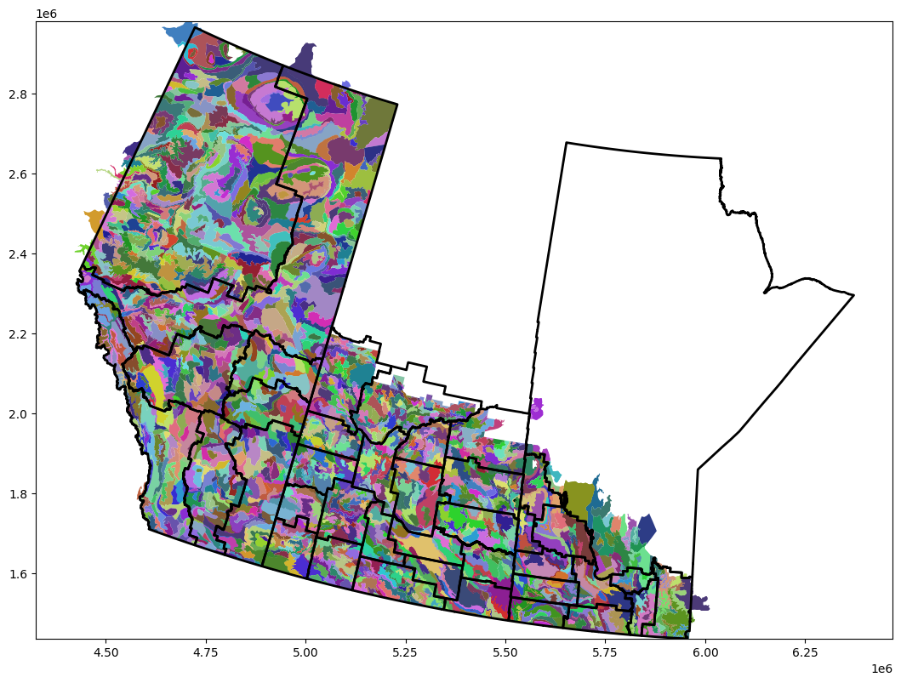

<div align="center">
<h1>CGC Grain Outcome Predictions</h1>

<br>

<h4>Ergot is a plant disease that infects the developing grains of cereals and grasses. When ergot bodies instead of kernels emerge during kernel formation, ergot symptoms become visible. To find a strategy to prevent it sooner, it is crucial to identify the factors that encourage it to grow in grain. Our project aims to build a tool that supports this research and provides tools for data analysis for the Canadian Grain Commission.<h4>


<br>
<br>
<div align="right">

</div>
</div>

## Overview
- [Setting up the environment](#setting-up-the-environment)
    - [Host Dependencies](#host-dependencies)
    - [Setting up on Windows](#setting-up-on-windows)
    - [Setting up on Linux](#setting-up-on-linux)
    - [Containers](#containers)
        - [PGAdmin](#pgadmin)
        - [PostgreSQL](#postgresql)
        - [Tensorflow](#tensorflow)
    - [Using Aviary Labs](#using-aviary-labs)
        - [Setting up credentials](#setting-up-credentials)
        - [Commands](#commands)
        - [Accessing the system with VSCode](#accessing-the-system-with-vscode)
- [Data Sources](#data-sources)
- [Database Tables](#database-tables)
    - [census_ag_regions](#census_ag_regions)
    - [stations_hly](#stations_hly)
    - [stations_dly](#stations_dly)
    - [mb_staion_data](#mb_staion_data)
    - [ab_station_data](#ab_station_data)
    - [sk_station_data](#sk_station_data)
    - [copernicus_satelite_data](#copernicus_satelite_data)
    - [ergot_sample](#ergot_sample)
    - [labeled_soil](#labeled_soil)
    - [soil_geometry](#soil_geometry)
    - [soil_components](#soil_components)
    - [soil_data](#soil_data)
    - [soil_surronding_land](#soil_surronding_land)
- [Useful links](#useful-links)

<br>
<hr>
<br>

## Setting up the environment
Our current environment uses docker compose to launch containers housing [PGADMIN4](#pgadmin), [PostgreSQL](#postgresql) and the latest [Tensorflow Container with Jupyter Lab](#tensorflow). 


### Host Dependencies
- [Docker](https://www.docker.com/products/docker-desktop/)
- [Docker Compose](https://docs.docker.com/compose/install/)
- [Python](https://www.python.org/downloads/)
- [Tensorflow](https://www.tensorflow.org/install/docker)
    - NVIDIA GPU Drivers (if using tensorflow-gpu) follow [official guide](https://docs.nvidia.com/deeplearning/frameworks/tensorflow-release-notes/running.html) guide for installation.

<br>

### Setting up on Windows
1. Install dependencies and clone project

2. Navigate to the project directory 

3. Create a .env file which satisfies the requirements of [.env.template](src/docker/.env.template). **Ensure this .env file can be found inside of the src/docker directory**

4. Run ```setup.bat``` located in the root folder of the project directory. This launches 3 different containers: postgres, pgadmin, and tensorflow-cpu

5. Refresh the webpages that appear to respectively load pgadmin and Jupyter labs. Jupyter labs requires a token for entry.

<br>

### Setting up on Linux
1. Install dependencies and clone project. Note that installation commands should be ran with BASH. BASH can be activated by ```bash```

1. Navigate to the project directory then enter the command ```cd src/docker```

2. Create a .env file which satisfies the requirements of [.env.template](src/docker/.env.template)

3. Run docker-compose for the containers you would like to use from the src/docker directory. The following is a list of the docker compose options:
    - all containers: ```sudo docker-compose --env-file=.env -f gpu-swarm.yaml up -d```
    - postgres: ```sudo docker-compose --env-file=.env -f postgres.yaml up -d```
    - pgadmin: ```sudo docker-compose --env-file=.env -f pgadmin.yaml up -d```
    - tensorflow-gpu: ```sudo docker-compose -f tensorflow-gpu.yaml up -d```
    - tensorflow-cpu: ```sudo docker-compose -f tensorflow-cpu.yaml up -d```

<br>

### Containers 

#### PGADMIN
- PGADMIN (optional) is a web-based interface for managing PostgreSQL databases. It is used to manage the database and can be accessed at http://localhost:5433. The default credentials are:
    - Email: xxxxxxxx
    - Password: xxxx

#### PostgreSQL
- PostgreSQL is a relational database management system. It is used to store the data and can be accessed at http://localhost:5432. The default credentials are:
    - Username: xxxxxxxx
    - Password: xxxx

#### Tensorflow
- Tensorflow-gpu is a machine learning framework. It is used to train the model and can be accessed at http://localhost:8888. 

- Tensorflow-cpu is a machine learning framework. It is used to train the model and can be accessed at http://localhost:8888. 

**NOTE: Jupyter Labs requires a token for entry. This token can be located in the following ways:**
- (*windows*) printed in the terminal used to run setup.bat 
- (*windows*) printed in the terminal of the docker container
- (*windows*) ```docker logs [container name]``` 
- (*linux*) ```sudo docker logs [container name]``` 

<br>
<hr>
<br>

## Using Aviary Labs
### Available machines:
- woodswallow-01
- woodswallow-02
- woodswallow-03
- woodswallow-04 (**holds main database**)
- guan (**holds test database**)

<br>

### Setting up credentials:
1. [Generate a personal access token for your GitHub account](https://github.com/settings/developers)
2. Run the following commands and use the token generated in step 1 as the password  
```git config --global user.name "yourusername"```  
```git config --global user.email "yourusername@users.noreply.github.com"```  
```git config --global user.password "your password"```  

**Note**: login information may differ if using a private email address  
These can later be verified by running
```git config --list```

<br>

### Commands
#### Cloning

```git clone https://github.com/ChromaticPanic/CGC_Grain_Outcome_Predictions.git```

#### Connecting via SSH

```ssh UMNetID@machine.cs.umanitoba.ca```  

#### Connecting via tunnel

```ssh UMnetID@machine.cs.umanitoba.ca -NL yourLocalPort:localhost:machinePort``` 

<br>

### Accessing the system with VSCode
1. Install Rmote - SSH extension
2. In the bottom left corner click on open a remote window
3. Click to connect to host
4. Enter aviary information in and follow prompts
5. Click on SSH: machine etc... (once connected - same place as in step 2)
6. Click attach to a running container
7. Select the desired container and follow prompts
8. Default location is root access .. and then select data folder

<br>
<hr>
<br>

## Data Sources

### Manual retrieval required
- [2006 Census Agricultural Regions](https://www150.statcan.gc.ca/n1/pub/92-174-x/2007000/carboundary/gcar000b07a_e.zip): digital boundaries for Canada's agriculture regions 
- [Weather Stations](https://dd.weather.gc.ca/climate/observations/climate_station_list.csv): list of weather stations that collect weather data spread throughout Canada
- [Harvest Canada Ergot Data](https://www.grainscanada.gc.ca/en/grain-quality/harvest-sample/): grain samples tested for Ergot

### Automated retrieval
- [Hourly Weather Station Data](https://dd.weather.gc.ca/climate/observations/hourly/): weather data (hourly) collected by Canadian weather stations
- [Daily Weather Station Data](https://dd.weather.gc.ca/climate/observations/daily/): weather data (daily) collected by Canadian weather stations
- [ERA5-Land Satelite Data](https://cds.climate.copernicus.eu/cdsapp#!/dataset/reanalysis-era5-land?tab=overview): satelite weather data 
- [Soil Moisture Data](https://www.esa.int/Applications/Observing_the_Earth/Space_for_our_climate/Nearly_four_decades_of_soil_moisture_data_now_available): satelite moisture data

<br>
<hr>
<br>

## Database Tables


### census_ag_regions
|car_uid|car_name|pr_uid|ag_uid|geometry|cr_num|
| ------------- | ------------- | ------------- | ------------- | ------------- | ------------- |
| region identifer  | region name  | province identifier  | | region boundaries  | crop region number (often used as the reference)


<br>

### stations_hly
### stations_dly
|station_name|province|latitude|longitude|elevation|station_id|wmo_identifier|tc_identifer|first_year|last_year|hly_first_year| hly_last_year|dly_first_year|dly_last_year|mly_first_year| mly_last_year|geometry|cr_num|
| ------------- | ------------- | ------------- | ------------- | ------------- | ------------- | ------------- | ------------- | ------------- | ------------- | ------------- | ------------- | ------------- | ------------- | ------------- | ------------- | ------------- | ------------- | 
||province abbreviation|EPSG:3347|EPSG:3347||unique identifier|||year of first records|year of last records|year of first hourly records|yea of last hourly records|year of first daily records|year of last daily records|year of first monthly records| year of last monthly records||crop region number

<br>

### mb_staion_data 
### ab_station_data
### sk_station_data
|station_id|date|year|month|day|max_temp|min_temp|mean_temp|total_rain|total_snow|total_precip|snow_on_grnd|
|-|-|-|-|-|-|-|-|-|-|-|-|
||||||°C|°C|°C|mm|cm|mm|cm|

<br>
<br>
<br>

### soil_moisture
|date|province|latitude|longitude|soil_moisture|
|-|-|-|-|-|
|||EPSG:3347|EPSG:3347|<2cm thickness in %|

<br>
<br>

### copernicus_satelite_data
|lon|lat|datetime| dewpoint_temperature| temperature | evaporation_from_bare_soil | skin_reservoir_content  | skin_temperature | snowmelt | soil_temperature_level_1| soil_temperature_level_2| soil_temperature_level_3 | soil_temperature_level_4  | surface_net_solar_radiation | surface_pressure | volumetric_soil_water_layer_1 | volumetric_soil_water_layer_2  | volumetric_soil_water_layer_3  | volumetric_soil_water_layer_4 |leaf_area_index_high_vegetation|leaf_area_index_low_vegetation|
| ------------- | ------------- | ------------- | ------------- | ------------- | ------------- | ------------- | ------------- | ------------- | ------------- | ------------- | ------------- | ------------- | ------------- | ------------- | ------------- |------------- |------------- |------------- |-|-|
|EPSG:3347|EPSG:3347||2m_dewpoint_temperature*|2m_temperature*


All data descriptions can be found [here](https://cds.climate.copernicus.eu/cdsapp#!/dataset/reanalysis-era5-land?tab=overview).  
Please note that all attributes are listed one to one minus the two corrected above (due to SQL restrictions)

<br>
<br>

### ergot_sample

|sample_id|year|province|crop_district|incidence|severity|
| ------------- | ------------- | ------------- | ------------- | ------------- | ------------- |
| sample identifier  |   | province abbreviation  | crop region number | truth value for the presence of ergot | percentage of severity detected|

<br>
<br>

### labeled_soil
|id|poly_id|soil_ids|cr_num|car_uid|
|-|-|-|-|-|
|unique identifier||list of all soil ids in the region|crop region|crop region district|

<br>


<br>
<br>
<br>

### soil_geometry
|area|perimeter|poly_id|geometry|
|-|-|-|-|
|||unique identifier|EPSG:3347|

All data descriptions can be found [here](https://sis.agr.gc.ca/cansis/nsdb/slc/v3.2/pat/index.html). 

<br>
<br>

### soil_components
|poly_id|cmp|percent|slope|stone|surface_area|province|soil_code|modifier|profile|soil_id|coarse_frag_1|coarse_frag_2|coarse_frag_3|depth|water_holding_cap|
|-|-|-|-|-|-|-|-|-|-|-|-|-|-|-|-|
|coresponding polygon|component identifer (increments)|polygon percentage occupying component||||abbreviation||defines soil characteristics||

All data descriptions can be found [here (components)](https://sis.agr.gc.ca/cansis/nsdb/slc/v3.2/cmp/index.html) and [here (ratings)](https://sis.agr.gc.ca/cansis/nsdb/slc/v3.2/crt/index.html). 

<br>
<br>

### soil_data
|id|province|code|modifier|name|kind|water_table|root_restrict|restr_type|drainage|parent_material_texture_1|parent_material_texture_2|parent_material_texture_3|parent_material_chemical_1|parent_material_chemical_2|parent_material_chemical_3|mode_of_depo_1|mode_of_depo_2|mode_of_depo_3|layer_no|u_depth|l_depth|hzn_lit|hzn_mas|hzn_suf|hzn_mod|percnt_coarse_frag|sand_texture|percnt_v_fine_sand|total_sand|total_silt|total_clay|percnt_carbon|calcium_ph|proj_ph|percnt_base_sat|cec|ksat|water_reten_0|water_reten_10|water_reten_33|water_reten_1500|bulk_density|elec_cond|calc_equiv|decomp_class|percnt_wood|
|-|-|-|-|-|-|-|-|-|-|-|-|-|-|-|-|-|-|-|-|-|-|-|-|-|-|-|-|-|-|-|-|-|-|-|-|-|-|-|-|-|-|-|-|-|-|-|

All data descriptions can be found [here (names)](https://sis.agr.gc.ca/cansis/nsdb/soil/v2/snt/index.html) and [here (layers)](https://sis.agr.gc.ca/cansis/nsdb/soil/v2/slt/index.html). 

<br>
<br>

### soil_surronding_land
|poly_id|land_area|water_area|fresh_area|ocean_area|total_area|
|-|-|-|-|-|-|
|unique identifier|in hectares|in hectares|in hectares|in hectares|in hectares|

All data descriptions can be found [here](https://sis.agr.gc.ca/cansis/nsdb/slc/v3.2/lat/index.html). 

<br>
<hr>
<br>

## Useful links:
- [Historical Weather Trends in Canada](https://climate.weather.gc.ca/index_e.html)
- [Agricultural Ecumene Boundary File - 2006](https://open.canada.ca/data/en/dataset/a3cc4d0a-34f8-4664-bb54-863427fb2243)
- [2006 Agricultural Ecumene Census Division Boundary Reference Guide](https://ftp.maps.canada.ca/pub/statcan_statcan/Agriculture_Agriculture/agricultural-ecumene-2006_ecoumene-agricole-2006/Agec2006RefGuide_EN.pdf)
- [Census Agricultural Regions Boundary Files of the 2006 Census of Agriculture](https://www150.statcan.gc.ca/n1/pub/92-174-x/92-174-x2007000-eng.htm)
- [Census Agricultural Regions 2006 Census of Agriculture Reference Guide](https://www150.statcan.gc.ca/pub/92-174-g/92-174-g2007000-eng.pdf)
- [Canadian Soil Landing Page](https://sis.agr.gc.ca/cansis/nsdb/slc/v3.2/index.html)
- [Canadian Soil Entity Relationship Map](https://sis.agr.gc.ca/cansis/nsdb/slc/v3.2/model.html)
- [OAS Weather Station API Documentation](https://api.weather.gc.ca/openapi?f=html#/)